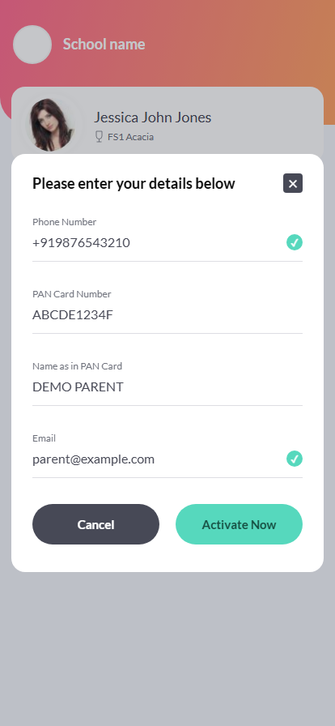

# Flow evidence

Captured from the production Angular/Nginx + Spring Boot + MySQL Docker stack at a 414×896 viewport. Every submitted detail is synthetic.

| Step | Screenshot |
| --- | --- |
| 1. API-backed dashboard | [01-dashboard.png](01-dashboard.png) |
| 2. Empty activation modal with disabled submit | [02-activation-form.png](02-activation-form.png) |
| 3. Invalid phone/email with inline errors and disabled submit | [03-validation-errors.png](03-validation-errors.png) |
| 4. Normalized valid details and green ticks | [04-valid-details.png](04-valid-details.png) |
| 5. Successful activation and return to dashboard | [05-activated-dashboard.png](05-activated-dashboard.png) |
| 6. Persisted Activated status after reload | [06-persisted-after-reload.png](06-persisted-after-reload.png) |

The evidence browser test also checks that invalid input keeps submission disabled and writes no activation, and that valid submission writes exactly one normalized MySQL record. See `frontend/e2e/activation.spec.ts`.

Regenerate using the commands in the root README. Capture output is committed intentionally; failure traces/reports/videos remain ignored local artifacts.

