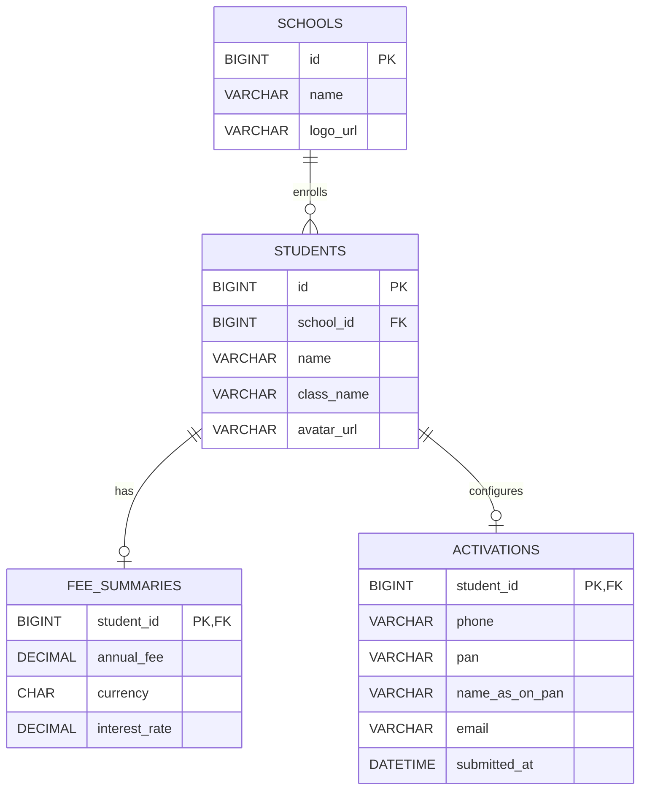

# Database schema

Flyway owns DDL; Hibernate uses `ddl-auto=validate`. MySQL 8.4 is used for development, containers, integration tests, and browser tests.

- Monetary amounts use `DECIMAL(12,2)`; interest uses `DECIMAL(5,2)`. Database checks reject negative values.
- Foreign keys prevent orphaned students, fees, or activations. The activation primary key enforces one activation per student.
- `V1` creates the schema. `V2`, in the dev migration location, inserts fictional demo data matching the supplied Figma text.
- The dev profile is enabled explicitly in local commands and Docker Compose. The default profile does not load demo data and requires a database password through configuration.
- Never turn off the dev migration location for a database that has already recorded V2 without planning migration history compatibility. Production would use a separate database and controlled data import.
- Cancellation writes nothing. An activation row's existence is the Activated state; there is no separately mutable flag to drift out of sync.

The local assessment stores synthetic PAN/contact values in plaintext. Production handling would require access control, encryption/tokenization, retention policies, and secret management before real personal data is introduced.
